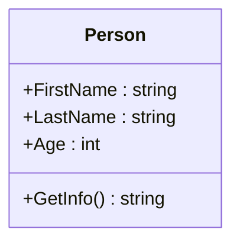
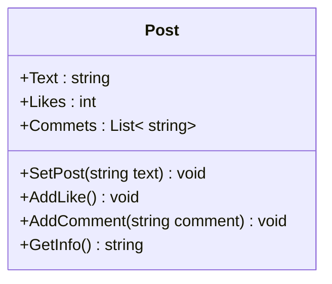
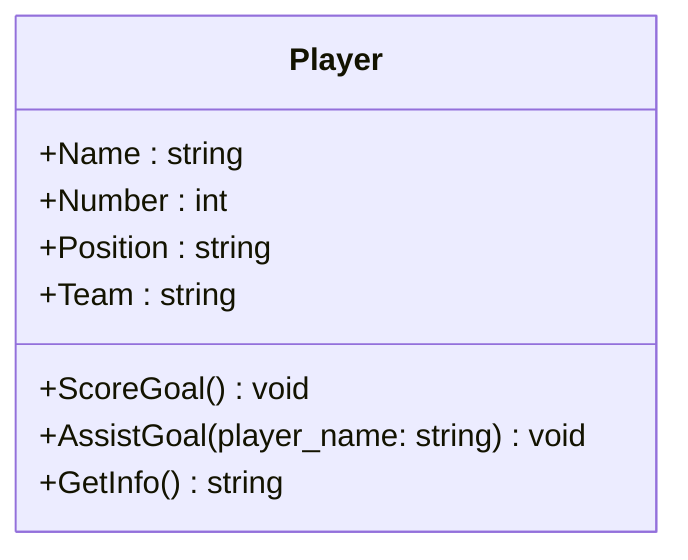
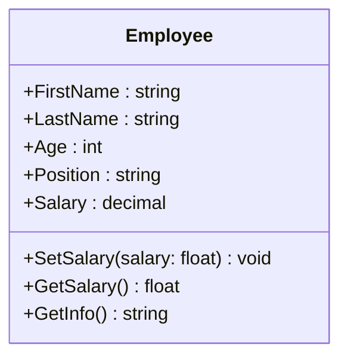

### Task1

Create a class called `Person` with folowing properties : `FirstName`, `LastName` and `Age`. 

You should create a method called `GetInfo()`. The method should return info about person.

----

Создайте класс под названием `Person` со следующими свойствами: `FirstName`, `LastName` и `Age`.

Вам следует создать метод под названием `GetInfo()`. Метод должен возвращать информацию о человеке.

---- 

Клас бо номи `Person` созед, ки дорои атрибутҳои зерин аст: `FirstName`, `LastName` ва `Age`.

Шумо бояд метод бо номи `GetInfo()` созед. Ин метод бояд маълумотро дар бораи шахс баргардонад.


**Input**
```
Enter your FirstName : Muhammad
Enter your LastName : Mirzoev
Enter your Age : 25
```

**Output**
```
FirstName: Muhammad
LastName: Mirzoev
Age: 25 
```

### Task2 

Create class called `Post` with folowing properties : `Text` , `Likes` , `Comments`

**Properties:**
* **`Text`**: The text of the post. 
* **`Likes`**: The number of likes on the post. 
* **`Comments`**: A list of comments on the post.

**Methods :**

* **`SetPost(string text)`**: Creates a new post .

* **`AddLike()`**: Increments the number of likes by one.

* **`AddComment(string comment)`**: Adds a new comment to the post.

* **`GetInfo()`**: Displays information about the post, including its text, number of likes, and comments.

----

Создайте класс под названием **`Post`** со следующими свойствами: **`Text`**, **`Likes`**, `Comments`.

**Атрибуты:**
* **`Text`**: текст сообщения.
* **`Likes`**: количество лайков публикации.
* **`Comments`**: список комментариев к публикации.

**Методы:**

* **`SetPost(string text)`**: Создает новое сообщение .

* **`AddLike()`**: увеличивает количество лайков на один.

* **`AddComment( string comment)`**: добавляет новый комментарий к сообщению.

* **`GetInfo()`**: отображает информацию о публикации, включая ее текст, количество лайков и комментариев.

----

Клас бо номи `Post` созед , ки дорои атрибутҳои зерин аст: `Text` , `Likes` , `Comments`

**Атрибутхо:**
* **`Text`**: Матни пост.
* **`Likes`**: Шумораи лайкҳо дар пост.
* **`Commets`**: Рӯйхати каментарияхо дар бораи пост.

**Методхо:**

* **`SetPost(string text)`**: Пости нав месозад.

* **`AddLike()`**: Шумораи лайкҳоро як маротиба зиёд мекунад.

* **`AddComment(string comment)`**: Ба пост каментарияи нав илова мекунад.

* **`GetInfo()`**: Маълумот дар бораи пост, аз ҷумла матни он, шумораи лайкҳо ва каментарияхоро нишон медиҳад.




**Output**
```
Text = It is Post
Likes : 2

Comments : 
Super
Great
```

### Task3

Create a class named `Player` with the following properties: `Name`, `Number`, `Position`, and `Team`.

Implement the following methods:

`ScoreGoal()`: This method should simulate the player scoring a goal and print a message indicating the player's name, jersey number, and the fact that they scored a goal.

`AssistGoal(string playerName)`: This method should simulate the player assisting another player in scoring a goal and print a message indicating both players' names and the fact that a goal was assisted.

`GetInfo()`: This method should return a string with information about the player, including their name, jersey number, position, and team.

----

Создайте класс с именем `Player` с следующими свойствами: `Name` (Имя), `Number` (Номер на майке), `Position` (Позиция на поле) и `Team` (Команда).

Реализуйте следующие методы:

`ScoreGoal()`: Этот метод должен имитировать забивание гола игроком и выводить сообщение с именем игрока, номером на майке и фактом того, что он забил гол.

`AssistGoal(string playerName)`: Этот метод должен имитировать передачу мяча другому игроку, который забивает гол, и выводить сообщение с именами обоих игроков и фактом того, что гол был забит с передачи.

`GetInfo()`: Этот метод должен возвращать строку с информацией об игроке, включая его имя, номер на майке, позицию на поле и команду.

---- 

Клас  бо номи `Player` бо хосиятҳои зерин созед: `Name`, `Number` , `Position` ва `Team`.

Усулҳои зеринро амалӣ кунед:

`ScoreGoal()`:ин метод бояд номи бозингар ва рақами пироханашро нашрнамояд вақте ки гол мезанад.

`AssistGoal(string playerName)`: ин метод номи бозгарони гол зада ва асист кардаро нашрнамояд.

`GetInfo ()`: Ин усул  маълумот дар бораи бозигар, аз ҷумла ном, рақами ҷома, мавқеъ ва даста баргардонад.


**Input**
```
Enter player's name: Lionel Messi
Enter player's number: 10
Enter player's position: Forward
Enter player's team: Barcelona

```

**Output**
```
Name: Lionel Messi
Number: 10
Position: Forward
Team: Barcelona

```

**Input**
```
Player Lionel Messi scores a goal.
Player Lionel Messi assists a goal for Neymar.

```

**Final Output**
```
Name: Lionel Messi
Number: 10
Position: Forward
Team: Barcelona
Lionel Messi scores a goal!
Lionel Messi assists a goal for Neymar.

```

### Task4

Create a class named `Employee` with the following properties: `FirstName`, `LastName`, `Age`, `Position`, and `Salary`.

Implement the following methods:

`SetSalary(decimal salary)`: This method should allow setting the salary of the employee.

`GetSalary()`: This method should return the current salary of the employee.

`GetInfo()`: This method should return a string containing information about the employee, including their first name, last name, age, position, and salary.

----

Создайте класс с названием `Employee` с следующими свойствами: `FirstName` (Имя), `LastName` (Фамилия), `Age` (Возраст), `Position` (Должность) и `Salary` (Зарплата).

Реализуйте следующие методы:

`SetSalary(decimal salary)`: Этот метод должен позволять установить зарплату сотрудника.

`GetSalary()`: Этот метод должен возвращать текущую зарплату сотрудника.

`GetInfo()`: Этот метод должен возвращать строку с информацией о сотруднике, включая его имя, фамилию, возраст, должность и зарплату.

---- 

Клас  бо номи `Employee`  бо хосиятҳои зерин созед:`FirstName`, `LastName`, `Age`, `Position` ва `Salary`.

Усулҳои зеринро амалӣ кунед:

`SetSalary(decimal salary)`: Ин усул бояд имкон диҳад, ки маоши корманд муқаррар карда шавад.

`GetSalary()`: Ин усул бояд маоши ҷории кормандро баргардонад.

`GetInfo()`: Ин усул бояд сатри дорои маълумот дар бораи корманд, аз ҷумла ном, насаб, синну сол, вазифа ва маоши онҳо баргардад.


**Input**
```
Enter employee's FirstName: John
Enter employee's LastName: Doe
Enter employee's Age: 30
Enter employee's Position: Manager
Enter employee's Salary: 50000

```

**Output**
```
FirstName: John
LastName: Doe
Age: 30
Position: Manager
Salary: 50000.0

```

**Input**
```
Set a new Salary: 55000
```

**Final Output**
```
FirstName: John
LastName: Doe
Age: 30
Position: Manager
Salary: 55000.0

```


