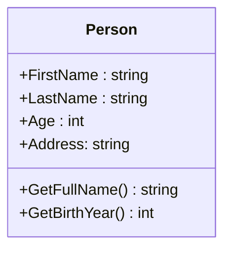
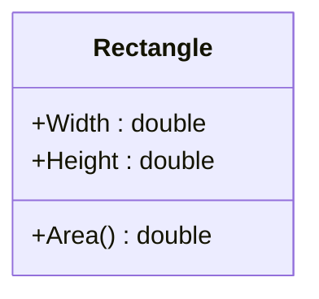
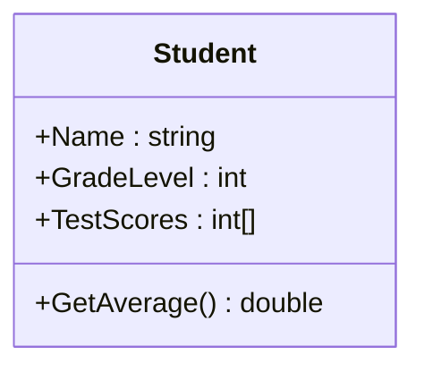
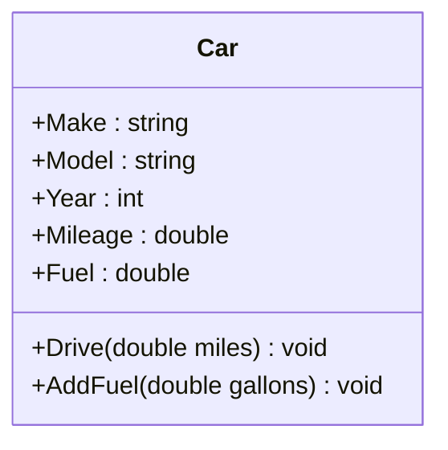

### Task 1
Create a class named `Person` with properties : `Firstname` , `Lastname` , `Age` , and `Address`.       
Also include a method `GetFullName()` that returns the person's full name (i.e. first and last name).      
Then create an object of the `Person` class and set its properties.                   
Finally, call the method to return the person's full name and print it to the console.           
Also create a method `GetBirthYear()` to get the year that the person was born biased on age.     

----

Создайте класс с именем `Person` с атрибутами : `Firstname` , `Lastname` , `Age` , and `Address`.         
Также добавьте метод `GetFullName()`, который возвращает полное имя человека (то есть имя и фамилию).          
Затем создайте объект класса `Person` и установите его свойства.                            
Наконец, вызовите метод, который возвращает полное имя человека и выведите его на консоль.               
Также добавьте метод `GetBirthYear()` для получения года рождения человека на основе его возраста.              

----

Класеро бо номи `Person` бо атрибутхои : `Firstname`, `Lastname`, `Age`, ва `Аddress` созед.                    
Инчунин методи `GetFullName()` илова кунед, ки номи пурраи шахсро бармегардонад ( ex: ном ва насаб).                  
Сипас объекти класи `Person` созед.                          
Ниҳоят, методеро даъват кунед, ки номи пурраи шахсро бармегардонад ва онро дар консол чоп кунед.             
Инчунин методе `GetBirthYear()` барои гирифтани соли таваллуди шахс вобаста ба синну солаш илова кунед.      



**Output**
```
My name is Shahrom Sharipov
My birth year is 2000.
```

##

### Task2 
Create a class named `Rectangle` with properties : `Width` and `Height`. Include a method `GetArea()` that calculates the area of the rectangle. Then create an object of the `Rectangle` class and set its properties. Call the method to calculate the area and print it to the console.             
Next, change the values of the `Width` and `Height` properties and recalculate the area.             
Print the new result to the console.            

----

Создайте класс под названием `Rectangle` с свойствами : `Width` and `Height`. Включите метод `GetArea()`, который вычисляет площадь прямоугольника. Затем создайте объект класса `Rectangle` и установите его свойства. Вызовите метод для вычисления площади и распечатайте ее в консоли.               
Затем измените значения свойств ширины и высоты и пересчитайте площадь.             
Распечатайте новый результат в консоли.

----

Класеро бо номи `Rectangle` созед, ки дорои атрибутхои `Width` and `Height`.             
Методи `GetArea()` созед, ки масохати росткунҷаро ҳисоб мекунад. Сипас объекти класси  `Rectangle` созед. Методи ҳисоб кардани масохатро даъват кунед ва онро ба консол чоп кунед.          
Сипас арзишҳои `Width` and `Height` - ро тағир диҳед ва масохатро аз нав ҳисоб кунед.       
Натиҷаи навро дар консол чоп кунед.   



**Input**
```
width = 7
height = 5
```
**Output**
```
Area = 35
```

##

### Task 3
Create a class named `Student` with properties : `Name` , `GradeLevel` (1,2,3,…11) and an array of test scores `Scores`.   

Include a method `GetAverage()` that calculates the average test score for the student. Then create an array of five  student objects with different `Names`, `GradeLevels`, and `Scores`. 

Finally, loop through the array and print out a personalized message to each student based on their average test score. If their average score is above 85, congratulate them and encourage them to keep up the good work. 

If their average score is below 70, offer support and suggest they seek additional help if needed. For scores between 70 and 85, give positive feedback and motivate them to strive for improvement.            

----

Создайте класс с именем `Student` с атрибутами `Name` , `GradeLevel` (1,2,3,…11) и списком оценок `Scores`.  

Включите метод `GetAverage()`, который вычисляет средний балл студента. Затем создайте массив из пяти объектов             
student с разными именами, уровнями класса и оценками. 

Наконец, переберите массив и напечатайте                 
индивидуальное сообщение каждому студенту на основе его средней оценки. 

Если его средний балл выше 85, поздравьте его и поощрите продолжать в том же духе. Если его средний балл ниже 70, предложите поддержку и посоветуйте обратиться за дополнительной помощью при необходимости. Для оценок между 70 и 85 дайте положительную обратную связь и мотивируйте его стремиться к улучшению.      

----
 
Класси бо номи `Student` созед, ки дорои хосиятҳо барои `Name` , `GradeLevel` (1,2,3,…11) ва рӯйхати холҳо `Scores` мебошад.      


Методи `GetAverage()` созед, ки холҳои миёнаи санҷишро барои донишҷӯ ҳисоб мекунад.            Сипас массиви аз панҷ объектҳои донишҷӯён бо номҳо, сатҳҳои синф ва холҳои санҷишии гуногун созед.

Дар ниҳоят, тавассути массив, паёмро ба ҳар як донишҷӯ дар асоси холҳои миёнаи санҷиши онҳо чоп кунед.              

Агар бахои миёнаи онхо аз 85 боло аст, онхоро табрик намоед.               
Агар бахои миёнаи онхо аз 70 паст бошад, дастгирӣ пешниҳод кунед ва пешниҳод кунед, ки агар лозим бошад, ба онҳо кӯмаки иловагӣ ҷӯянд. Барои холҳои аз 70 то 85, фикру мулоҳизаҳои мусбӣ диҳед ва онҳоро ташвиқ кунед, ки барои беҳтар шудан кӯшиш кунанд.       



**Output**
```
Congratulations Shahrom Sharipov on achieving above average scores (80.0) in grade 9!
Keep up the good work!
------------------------------------------------
Abdulloh Abdulloev, if you're having difficulties with your studies, don't hesitate to
seek help. Your current average score is 75.0 in grade 10.
-----------------------------------------------
Congratulations Nurullo Sulaymonov on achieving above average scores (95.0) in grade 11!
Keep up the good work!
------------------------------------------------
Congratulations Alijoni Zabiri on achieving above average scores (90.0) in grade12!
Keep up the good work!
------------------------------------------------
Congratulations Olimjon Tojiev on achieving an average score of 85.0 in grade 9!     
Keep working hard for even better results!
```

##
### Task4 

Create a class named `Car` . The class should have the following properties:

- `Make` (car make)
- `Model` (car model)
- `Year` (manufacturing year)
- `Mileage` (mileage in miles)
- `Fuel` (fuel level in gallons)
- Include a constructor to initialize the `make`, `model`, and `manufacturing year` of the car, setting default values for `mileage` and `fuel` `level to 0.`

Add methods:

- `Drive(double miles)`: A method to drive the car for a specified number of miles. If the fuel level is insufficient, print a message -indicating the need to refuel. Otherwise, decrease the fuel level and increase the mileage.

- `AddFuel(double gallons)`: A method to add a specified amount of fuel to the car's tank.

----
Создайте класс `Car`. Класс должен иметь следующие свойства:

- `Make` (марка автомобиля)
- `Model` (модель автомобиля)
- `Year` (год выпуска)
- `Mileage` (пробег в милях)
- `Fuel` (уровень топлива в галлонах)
Также добавьте конструктор для инициализации марки, модели и года выпуска автомобиля, устанавливая значения пробега и уровня топлива по умолчанию в 0.

Добавьте методы:

- `Drive(double miles)`: Метод для езды на указанное количество миль. Если уровень топлива недостаточен, выведите сообщение о необходимости заправки. В противном случае уменьшите уровень топлива и увеличьте пробег.

- `AddFuel(double gallons)`: Метод для добавления указанного количества топлива в бак.

----
Класси `Car` созед. Класс бояд дорои хосиятҳои зерин бошад:

- `Make` (марка)
- `Model` (модели мошин)
- `Year` (соли нашр)
- `Mileage` (километр дар мил)
- `Fuel` (сатҳи сӯзишворӣ бо галлон)
Инчунин ба конструктор илова кунед: тамға, модел ва соли мошинрo, масофа ва сатҳи сӯзишвориро ба 0 муқаррар кунед.

Илова кардани усулҳо:

- `Drive(double miles)`:  Агар сатҳи сӯзишворӣ нокифоя бошад, паёмеро нишон диҳед, ки зарурати пур кардани сӯзишвориро нишон медиҳад. Дар акси ҳол, сатҳи сӯзишвориро кам кунед ва масофаро зиёд кунед.

- `AddFuel(duble gallons)`: Усули илова кардани миқдори муайяни сӯзишворӣ ба бак.




**Input**
```csharp
// Creating a Car object
Car myCar = new Car("Toyota", "Camry", 2022);

// Printing initial information
Console.WriteLine($"Make: {myCar.Make}");
Console.WriteLine($"Model: {myCar.Model}");
Console.WriteLine($"Year: {myCar.Year}");
Console.WriteLine($"Mileage: {myCar.Mileage} miles");
Console.WriteLine($"Fuel level: {myCar.Fuel} gallons");

// Driving the car
myCar.Drive(100);

// Adding fuel
myCar.AddFuel(10);

// Printing updated information
Console.WriteLine($"\nAfter the trip and refueling:");
Console.WriteLine($"Mileage: {myCar.Mileage} miles");
Console.WriteLine($"Fuel level: {myCar.Fuel} gallons");

```

**Output**
```
Make: Toyota
Model: Camry
Year: 2022
Mileage: 0 miles
Fuel level: 0 gallons

You have driven 100 miles. Current mileage: 100 miles. Remaining fuel: 5 gallons.
Added 10 gallons of fuel. Current fuel level: 15 gallons.

After the trip and refueling:
Mileage: 100 miles
Fuel level: 15 gallons

```
